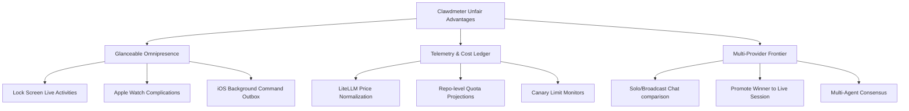

# Competitive Analysis: Clawdmeter vs. Cursor and Conductor
**The Landscape of Agentic Coding Platforms**  
*Date: May 25, 2026*  
*Status: Strategy & Research Brief*  

---

## Executive Summary

**Clawdmeter** occupies a highly unique, developer-centric niche: it is a **native local-first control plane and mobile/wearable companion** for developers running CLI-based AI coding agents (Claude Code, Codex, Gemini/Antigravity, and OpenCode) locally on their macOS or Linux machines. 

Its core product wedge is visceral and immediate: **"Run agents on your Mac; monitor, approve, and steer them from your iPhone or Apple Watch."**

However, to become a truly competitive platform in the rapidly maturing AI-assisted engineering landscape, Clawdmeter must be evaluated against two dominant, highly capitalized product paradigms:

1. **Cursor (The Integrated Editor & Intelligence Loop):** An AI-first VS Code fork that owns the user's keyboard cursor, active file buffers, and local terminal. It excels at low-latency inline code completions, multi-file code generation (Composer), and automated codebase RAG (semantic search).
2. **Conductor by Melty Labs (The Parallel Agent Orchestrator):** A desktop workbench designed specifically to coordinate a "fleet" of virtual junior developers. It automates isolated Git worktrees, visualizes parallel feature branches, and manages testing/merging flows across multiple concurrent agents.

This document breaks down the **architectural, strategic, and feature-level gaps** that Clawdmeter must bridge to compete with Cursor and Conductor, defines Clawdmeter's **unfair advantages**, and details a **tactical roadmap** to elevate Clawdmeter from a "clever companion cockpit" into a dominant, high-leverage developer platform.

---

## The Landscape: At a Glance

| Feature / Dimension | **Clawdmeter** | **Cursor** | **Conductor (Melty Labs)** |
| :--- | :--- | :--- | :--- |
| **Product Category** | Native mobile/desktop control plane & companion | Full AI-first integrated development environment (IDE) | Multi-agent parallel workbench & git worktree manager |
| **Form Factor** | Mac (menu-bar + Tahoe window), iOS, watchOS, Linux | Desktop application (fork of VS Code) | macOS desktop app |
| **Primary Wedge** | Mobile plan approvals, cost analytics, model comparisons | Inline autocompletions (Cursor Tab) & multi-file editing | Running 3–5 agents in parallel in clean, isolated git worktrees |
| **Code Modification** | *Indirect:* Spawns external CLI agents (tmux/LSP) to edit files | *Direct:* Inline `Cmd+K`, codebase Composer `Cmd+I` with instant diffs | *Indirect:* Manages external agent instances (Claude Code, Codex CLI) |
| **Repository Intelligence** | Basic file mentions (`@`), active session citations | Auto-refreshing vector index, AST graphs, codebase semantic search | Relies on the underlying CLI agents (e.g., Claude Code's own search) |
| **Multi-Agent Scale** | Supports multiple sessions but focused on a single active run | Single-developer active editor; linear agent runs in Composer | Explicitly orchestrates a parallel fleet of virtual junior engineers |
| **Pervasive Control** | Paired iPhone/Watch app, background alerts, local notifications | None (strictly desktop) | None (strictly desktop) |
| **Economics & Quota** | Live token tracking, $ cost ledger, LiteLLM-priced, cap warnings | Proprietary fast-inference plans & metered usage metrics | BYOK (uses standard CLI credentials), no in-depth cost logs |
| **Auth & Security** | Local-first, bearer tokens, Tailscale whois, sandboxed | Cloud account synced, custom AI server proxy | Local credentials, reads active local CLI configs |

---

## 1. Feature-by-Feature Strategic Gaps

### VS. CURSOR (The Autocomplete & IDE Powerhouse)

Cursor's dominance is driven by **owning the writing loop**. Because it is a full editor fork, it is deeply integrated into the developer's muscle memory.

#### Gaps Clawdmeter Must Address:
1. **No Autocomplete or Inline Code Generation (The Core Dev Loop):**
   * *Cursor:* "Cursor Tab" (Copilot++) is a custom, low-latency, context-aware autocomplete engine that predicts multi-line edits. `Cmd+K` lets you modify code blocks in-place with instant side-by-side or inline diffs.
   * *Clawdmeter:* Has no text editor engine. It displays a terminal and parses JSONL outputs to show a chat. If a user wants to quickly write code themselves, they must switch away from Clawdmeter to another IDE (like Cursor or VS Code).
2. **Lacking Codebase-Wide RAG and Semantic Indexing:**
   * *Cursor:* Automatically builds a local vector index of the repository, creates an Abstract Syntax Tree (AST) symbol index, and constructs a code structure graph. Users can prompt with `@Codebase` to search across all files semantically.
   * *Clawdmeter:* The `@MentionPicker` is limited to active sessions, agent-cited files, and recent JSONLs. It has a basic file-walker (`RepoIndex`) but possesses no vector database, semantic embedding models, or structural codebase indexing.
3. **Optimized Multi-File Composer (`Cmd+I`):**
   * *Cursor:* The "Composer" operates as an agent across the workspace, editing 5 files concurrently. The UI presents clean, interactive side-by-side code diffs for every modified file, allowing developers to reject/accept individual hunks directly within the editor tree.
   * *Clawdmeter:* Relies entirely on the downstream agent CLI (like `claude --permission-mode acceptEdits`) to execute modifications. Clawdmeter's "Git Diff" pane allows basic stage/revert of hunks, but it lacks a cohesive, multi-file code editing/review UI.
4. **Third-Party Documentation Crawling:**
   * *Cursor:* Allows users to input custom URLs (e.g., specific library documentation). Cursor crawls and indexes these pages, making them instantly queryable via `@Docs`.
   * *Clawdmeter:* Agents are blind to external, uncrawled web libraries unless the agent itself possesses web-search capability (e.g., Claude Code using Google search tool).

---

### VS. CONDUCTOR (The Parallel Agent Fleet Master)

Conductor's value proposition is scaling developer leverage by **treating AI agents as parallel virtual engineers**.

#### Gaps Clawdmeter Must Address:
1. **Automated, Seamless Git Worktree Isolation:**
   * *Conductor:* Automatically creates and manages isolated git worktrees for *every single task* under `~/conductor/workspaces/<repo>/<branch>`. It acts as the central coordinator, ensuring agents work in sandboxed environments without dirtying the main working tree or colliding.
   * *Clawdmeter:* While Clawdmeter has a `WorktreeManager` that can spawn sessions in `.claude/worktrees/*` (D7) and a basic 24-hour grace period GC (D12), its interface is not designed around parallel workspace visualization. It lacks visual conflict-resolution and cross-branch merge tooling.
2. **Multi-Agent "Team Dashboard" Visuals:**
   * *Conductor:* Visualizes agents as distinct entities (with mock names/avatars) working simultaneously on a backlog. The developer acts as a "Technical Lead" or "Conductor," monitoring the board, reviewing PRs, and coordinating the output.
   * *Clawdmeter:* Treats sessions as sequential chat files or tmux terminals. It has "Conductor-style sidebar buckets" (Active, In Review, Done, Archived) in its Mac dashboard, but does not provide a holistic "multi-agent team project board."
3. **Direct Backlog / Issue Tracking Integration:**
   * *Conductor:* Integrates directly with GitHub Issues or project boards to let you drag-and-drop a task, assign it to a virtual agent, and watch the agent create a branch, write the code, run tests, and open a PR.
   * *Clawdmeter:* Spawns sessions from explicit user prompts or manual goal-pinning. It has a PR Review pane, but lacks direct issue-to-agent task assignment pipelines.

---

## 2. Infrastructure & Mobile Gaps (The Experience Engine)

Because Clawdmeter's primary differentiator is **mobile control**, its mobile experience must be bulletproof. However, local-first architectures introduce severe network and platform limitations:

1. **The APNS & Background Notification Delay (Strategic Gap):**
   * *The Problem:* To protect developer privacy and avoid holding central Apple Developer Push certificates (`.p8`), Clawdmeter v2 uses local notifications + Background App Refresh polling (every 15–30 minutes) when the iPhone app is backgrounded.
   * *The Gap:* If a developer starts a 5-minute agent run on their Mac and walks away, they will not get a "Plan Ready" notification on their lock screen immediately. They must wait for iOS's background scheduler to trigger a poll (which can take 15–30 minutes) or keep the app active in the foreground.
   * *Cursor/Conductor Parity:* These desktop-only tools don't have mobile apps, but if they build web-hosted portals, they will have instant, cloud-brokered webhooks and push notifications.
2. **Zero-Config Network Remote Access (Friction Gap):**
   * *The Problem:* Clawdmeter pairs devices using Tailscale/MagicDNS or local network loopbacks to maintain strict end-to-end security.
   * *The Gap:* Non-technical developers or those who do not use Tailscale face severe friction trying to pair their iPhone with their Mac. If Tailscale connection drops, the phone app silently disconnects.
3. **Limited Input Surface on Wearables:**
   * *The Problem:* Apple Watch complications are highly constrained.
   * *The Gap:* The Watch app can approve a plan, but it cannot handle complex feedback loops (e.g., when the agent asks a clarifying question or when a terminal error occurs), forcing the user to pull out their phone or return to their desk.

---

## 3. Clawdmeter's Unfair Advantages (Where We Win)

We shouldn't try to beat Cursor at being a text editor, or Conductor at being a desktop-only git manager. Instead, Clawdmeter should exploit its native Apple-device ecosystem and telemetry focus to **leapfrog both platforms**.



### 1. Ubiquitous "Glanceable" Control (The Apple Ecosystem Integration)
Neither Cursor nor Conductor has a mobile presence. Clawdmeter owns the physical space:
* **Live Activities & Dynamic Island:** Displays real-time agent token burns, execution duration, and current sub-task status directly on the lock screen.
* **Apple Watch Complications:** A wrist-tap notification that a plan is ready, offering immediate "Approve" or "Interrupt" controls.
* **Local Daemon Bridge:** By hosting a native HTTP/WS engine on the Mac, it seamlessly control tmux sessions without exposing remote SSH ports to the internet.

### 2. Multi-Provider Broadcaster (The Chat V3 Wedge)
* Cursor locks you into their model gateway or custom API proxies. Conductor runs CLI instances in isolation.
* **Clawdmeter Chat V3** allows developers to **broadcast a single prompt to Claude, Codex, and Gemini side-by-side**, compare the outputs, and instantly promote the winner to a live, interactive workspace. This multi-model consensus is a powerful, highly visual workflow.

### 3. The Unified "Cost Ledger" & Analytics Engine
* AI agents are expensive and consume token quotas rapidly. Cursor hides detailed token/dollar billing analytics. Conductor has no financial awareness.
* Clawdmeter reads local agent SQLite databases and JSONL logs, prices them with an embedded LiteLLM pricing snapshot, and aggregates them into a **visual repo-level and provider-level dashboard**. It is the only platform that answers: *"Which repo and which agent cost me $50 this week?"*

---

## 4. Actionable Strategic Roadmap

To neutralize Cursor's editor dominance and Conductor's multi-agent leverage, Clawdmeter should execute a **three-phased roadmap** that hardens its mobile capabilities while introducing lightweight repository intelligence and orchestration.

```
PHASE 1: Core Friction & APNS Push
   ├── Secure Cloud Relay (Zero-Config Tailscale Bypass)
   └── Zero-Latency Push Alerts (Secure APNS Gateway)
         │
         ▼
PHASE 2: Repository Intelligence
   ├── Lightweight Embeddings (Local RAG)
   └── Smart Context Mentions (@Folder / @Git)
         │
         ▼
PHASE 3: Orchestration & Workspace Depth
   ├── Parallel "Lead Developer" Board
   └── Web-to-Agent Feedback Loop
```

### Phase 1: Harden Mobile & Eliminate Connection Friction (Immediate)
*Goal: Make the mobile companion bulletproof, fast, and effortless to connect.*

* **Secure Cloud Relay (Zero-Config Connection):**
  * *Action:* Introduce an optional, end-to-end encrypted WebSocket relay server (e.g., `relay.clawdmeter.dev`). 
  * *Details:* The Mac daemon and iPhone establish outbound connections to the relay, completing pairing via public-key cryptography (similar to Signal or Tailscale). This bypasses the need for manual Tailscale setups or network configurations, reducing onboarding time to under 2 minutes.
* **Zero-Latency Push Notifications via Secure Gateway:**
  * *Action:* Build a lightweight cloud proxy that routes APNS notifications without possessing the developer's raw `.p8` credential.
  * *Details:* The Mac daemon sends an encrypted payload containing session events to a Clawdmeter APNS push gateway. The gateway signs the request and delivers it instantly to the iPhone, bypassing the 30-minute Background App Refresh lag.
* **Expand Watch Complication Family:**
  * *Action:* Implement `.accessoryCorner`, `.accessoryRectangular`, and `.accessoryInline` Apple Watch complications to support rich text progress strings and immediate plan-summary glances.

### Phase 2: Lightweight Repository Intelligence (Mid-Term)
*Goal: Provide Cursor-style codebase awareness without writing a custom text editor.*

* **Embeddings-in-a-Box (Local Vector DB):**
  * *Action:* Ship a lightweight, sandboxed vector library (like SQLite-VSS or a pure Swift embedding runner) inside the Mac app.
  * *Details:* On repository open, run a local embedding model in a background thread to index repo files. Expose a local search endpoint.
* **Rich Context Mentions:**
  * *Action:* Upgrade `@MentionPicker` to parse `.gitignore` and support full repository traversal. Add `@Codebase` (for semantic search), `@Diff` (current git changes), and `@Git` (recent commits) to allow rich context building from mobile.
* **"Texting Mode" turn filtering:**
  * *Action:* Hide massive terminal `tool_use` and `tool_result` tracebacks behind a clean "Ran 12 tools" dropdown. This makes scrolling long sessions on an iPhone feel clean and readable, like a modern messaging app.

### Phase 3: Lightweight Orchestration & Workspace Depth (Long-Term)
*Goal: Compete with Conductor's parallel developer fleet paradigm.*

* **Parallel "Lead Developer" Board:**
  * *Action:* Build a desktop Dashboard tab that represents active worktrees as columns on a Kanban board: `Backlog` -> `In Progress (Agent running)` -> `Review (Plan Waiting)` -> `Done (Commit/PR)`.
  * *Details:* Allow developers to assign different prompts to parallel git worktrees from a single dashboard, easily toggling visual focus between them.
* **In-App Browser Web-to-Agent Loop Polish:**
  * *Action:* Enhance the native Mac `WKWebView` integration (G13). When an agent builds a web UI, let the developer highlight a broken component in the live browser preview. 
  * *Details:* Clawdmeter automatically generates a clean CSS selector + DOM snapshot and feeds it back to the agent's prompt queue with one click.

---

## 5. Summary of Recommended Position

When pitching or describing Clawdmeter to the community and early adopters, **do not position Clawdmeter as a Cursor replacement.**

Instead, position Clawdmeter as **The Cockpit for the Agent Swarm**:

> *"Cursor is the editor you type in. Clawdmeter is the control plane for the agents that run in the background. Keep writing code in your preferred IDE, let Clawdmeter spawn isolated agent sessions on your Mac, and steer them from your iPhone and Apple Watch while you walk away."*

By doubling down on **ubiquitous mobile interaction, local cost ledger economics, and multi-provider comparisons**, Clawdmeter establishes a highly defensible, incredibly polished developer workspace that neither Cursor nor Conductor can easily duplicate.
